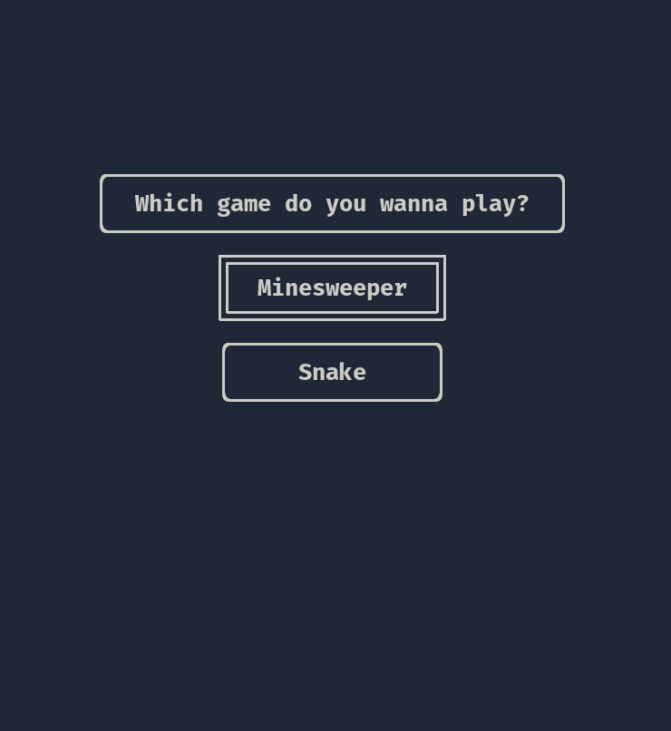
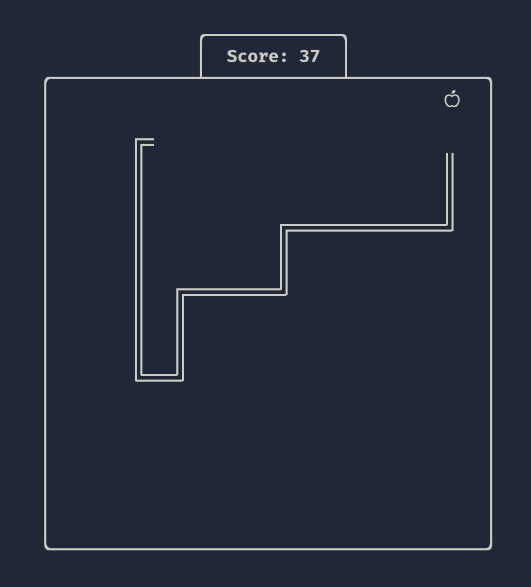
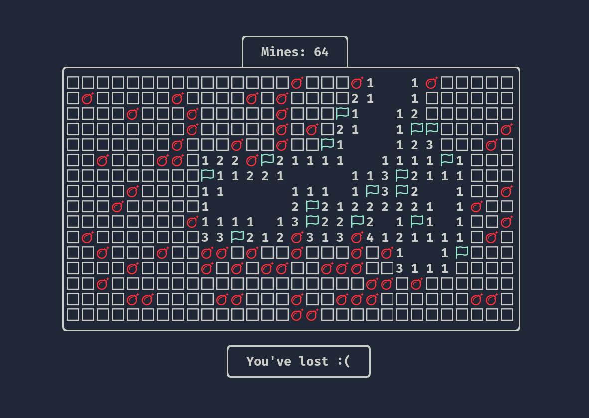

# Terminigames

A bunch of simple minigames you can play in your terminal.
Including snake, minesweeper, tetris and much more! (this is not yet true though).


## Showtime

<p align="center">
 
</p>

<p align="center">
 
</p>

<p align="center">
 
</p>


## Installation

Enter the following command (as root if necessary)
```sh
cmake --install .
```
This will add an executable `terminigames` to your path.

If you don't want to install right away, use
```sh
cmake --build .
```
This only creates the executable in the project directory.
